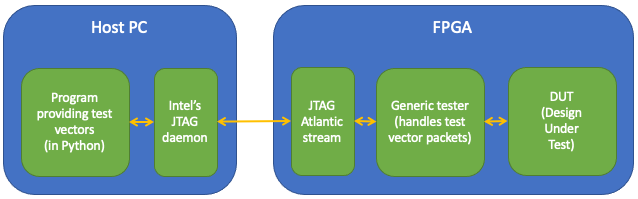
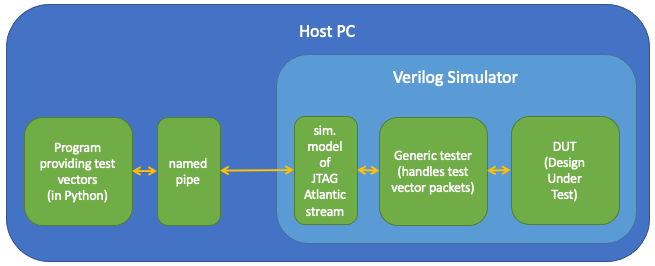
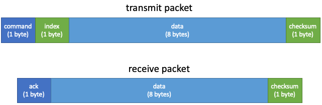

# DE10 Unit Tester

This provides a generic interface to a Stratix 10 FPGA (specifically
the Terasic DE10-Pro) board to allow a host computer to send test
vectors to a unit test on FPGA.  There is also a simulation only
version.  Tests are prepared in Python on the host and the test
framework+DUT (design under test) on FPGA are written in Bluespec
SystemVerilog.

### On FPGA

Below is a an outline of the test framework driving a DUT (design
under test) from a host PC (Linux box).  A small Python library
handles communication between the host and the FPGA, which allows test
vectors to be prepared in Python, sent to the FPGA and responses
checked.  Communication goes over the USB-to-JTAG cable used to
program the FPGA.



### In simulation

The test framework can also be used in simulation with a named pipe
(available on Linux) used for communication, replacing the USB-JTAG
link.



### Packet format

Currently the packet format is quite simple - see below.



The transmit packet contains:
* 1-byte command: nop, read, write, etc.
* 1-byte index that might be used to reference registers, fifos or
other bits of your test wrapper.
* 8-bytes (64b) of data
* A simple checksum, not that I've ever seen a bit error

The receive packet contains:
* 1-byte acknowledgement
* 8-bytes of response data (could be zero if there is no response)
* 1-byte checksum

For further details of the transmit commands and receive
acknowledgement symbols, please see `DebugCommand` and
`DebugResponseCode` enumeration types in
[bsv/FPGADebugInterface.bsv](bsv/FPGADebugInterface.bsv)

---
## Repository Structure

The directory structure:
* [bsv/](bsv) - Generic Bluespec SystemVerilog unit test source
* [de10/](de10) - DE10Pro FPGA board framework for running tests
* [figs/](figs) - figures for documentation
* [py/](py) - Generic unit test source for host side in Python
* [tests/](tests) - includes:
  * [namedpipe/](tests/namedpipe)
    * simulation only unit test of a named pipe
    * `make test` to run the test
  * [debugchannel/](tests/namedpipe)
    * simulation only unit test of debug channel framework
    * `make test` to run the test
  * [fpgadebuginterface/](tests/fpgadebuginterface)
    * on FPGA debug example
    * [tstFPGADebugInterface.bsv](tests/fpgadebuginterface/tstFPGADebugInterface.bsv)
      * Example Bluespec-side test that has four registers that can be read and written via index 0-3, and the same registers mapped to index 4-7 where writes result in the value written being added to the current register contents.
    * [tstdebug.py](tests/fpgadebuginterface/tstdebug.py)
      * Python test script that exercises the above Bluespec
    * Use `make clean;make fpga_clean;make fpga_build` to build the FPGA image incorporating tstFPGADebugInterface.bsv
    * Use `make program_fpga` to program the FPGA (the FPGA JTAG chain file may need updating to your setup)
    * Use `make fpga_test` to run they Python test script
  * [example_chip_id/](tests/example_chip_id) 
    * Example that demonstrates instantiating some Intel IP and testing it, in this instance reading the Chip ID built into the Stratix 10 FPGA
    * Use `make all` to build, download and run
    * Use `make help` for further information


---
## Building your own tests

Example tests are in `tests/`.  One approach to building your own test
is to fork this repository and add your own tests into `tests` using
fpgadebuginterface or example_chip_id as a template.

Alternatively you can clone this repository and put your tests into a
directory that is independent of this repository.  If you do that,
you'll need to adjust the paths in the Makefile that setup the paths
for `de10/Makefile` to build your design.  If you look at
`tests/example_chip_id/Makefile` you'll find the following paths set:

```
RTL_PATH = ../../bsv
DE10_PATH = ../../de10
PATH_DE10_TO_HERE = ../tests/example_chip_id
```

* `RTL_PATH` is the path to the tester library Bluespec
* `DE10_PATH` is the path to the `de10/` directory in this repository
* `PATH_DE10_TO_HERE` is the path from the `de10/` directory back to your DUT (design under test)

You will also need to adjust the following to suite your project:

```
TEST_NAME = ChipID
TOP_RTL = tst$(TEST_NAME).bsv
TOP_MODULE = top
INTEL_IP = chipid.ip
PYTHON_TESTER = read_chipid.py
```

---
## Using an alternative Stratix 10 board or other Intel FPGA

You will need to generate an alternative to the `de10/` generic project that is specific to your FPGA and board including:
* Pin definitions.  The main thing the tester needs is a clock unless you're testing other I/O.
* Reset logic (Intel Reset Release IP needed for Stratix 10)
* Constraints (sdc) file for clocks, etc
* The `DE10_Pro.qsf` has the following line added manually to include any test specific IP:
  `source dutip.qsf`
